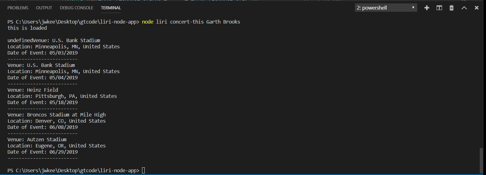
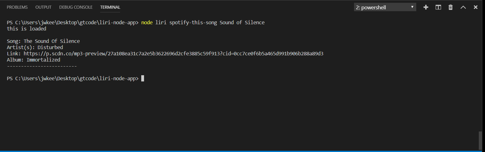
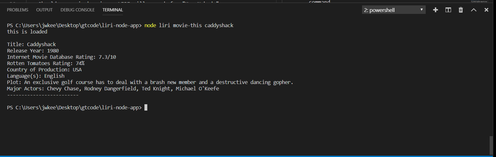
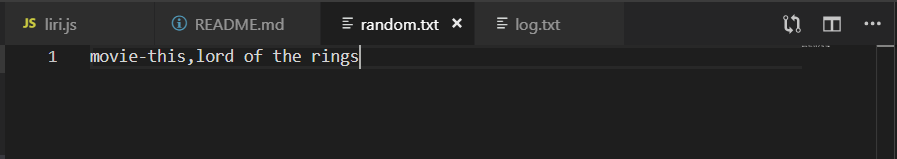
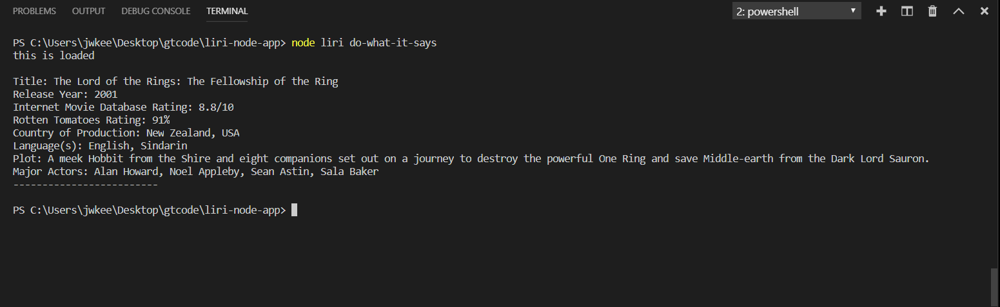

# liri-node-app

## Overview

LIRI (Language Interpretation and Recognition Interface) is a command line user interface which takes in a user command and returns data from various APIs pertaining to the specified search terms.

LIRI will also log all responses to a file named `log.txt`


## Accepted Commands

1. `node liri.js concert-this <artist/band name>`

    * LIRI will search the Bands in Town Artist Events API for an artist and display the Name and Location of the Venue and the Date of the Event for each upcoming event for the artist or band specified

    

2. `node liri.js spotify-this-song <song name>`

    * LIRI will search the spotify API for the Artist(s), Name, and Album for the specified song, as well as a preview link from Spotify. Should no song be given, LIRI will search for "The Sign"

    

3. `node liri.js movie-this <movie name>`

    * LIRI will search the OMDB API for the specified movie and display the following information:
        ```
         * Title
         * Release Year
         * IMDB Rating
         * Rotten Tomatoes Rating
         * Country where the movie was produced
         * Language of the movie
         * Plot
         * Actors
        ```
    Should no movie be given, LIRI will search for "Mr. Nobody"

    

4. `node liri.js do-what-it-says`

    * LIRI will read the `random.txt` file and run the command and search term, both given by the file

    
    